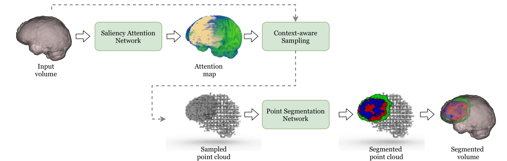

#### Table of contents
1. [Introduction](#introduction)
2. [Usage](#usage)
3. [Result ](#result)

# <a name="introduction"></a> Point-Unet: A Context-Aware Point-Based Neural Network for Volumetric Segmentation

This repository contains the implementation of the MICCAI 2021 paper Point-Unet: A Context-Aware Point-Based Neural Network for Volumetric Segmentation. Point-Unet is a point-based volumetric segmentation framework with three main modules: the saliency attention, the context-aware sampling, and the point-based segmentation module. The saliency attention module takes a volume as input and predicts an attentional probability map that guides the context-aware point sampling in the subsequent module to transform the volume into a point cloud. The point-based segmentation module then processes the point cloud and outputs the segmentation, which is finally fused back to the volume to obtain the final segmentation results. 



Details of the Point-Unet model architecture and experimental results can be found in our [following paper](https://rdcu.be/cyhME).  

```
@inproceedings{ho2021point,
  title={Point-Unet: A Context-Aware Point-Based Neural Network for Volumetric Segmentation},
  author={Ho, Ngoc-Vuong and Nguyen, Tan and Diep, Gia-Han and Le, Ngan and Hua, Binh-Son},
  booktitle={International Conference on Medical Image Computing and Computer-Assisted Intervention},
  pages={644--655},
  year={2021},
  organization={Springer}
}
```
**Please CITE** our paper when Point-Unet is used to help produce published results or incorporated into other software

## Usage
### Installation

The code is based on Tensorflow. It has been tested with Python 3.6.9, CUDA 9.0 on Ubuntu 18.04 (NVIDIA V100).

Install required python packages

```bash
$ conda env create -f environment.yml
$ sh PointSegment/compile_op.sh
```

### Data preparation

Download and organize [BraTS18](https://www.med.upenn.edu/sbia/brats2018/data.html), [BraTS19](https://www.med.upenn.edu/cbica/brats2019/data.html), [BraTS20](https://www.med.upenn.edu/cbica/brats2020/data.html) and [Pancreas](https://wiki.cancerimagingarchive.net/display/Public/Pancreas-CT) datasets from their official website. The dataset will be stored at the structure below with ```nii.gz``` format

```
dataset/BraTS2018/
  training/
  validation/

dataset/BraTS2019/
  training/
  validation/

dataset/BraTS2020/
  training/
  validation/

dataset/Pancreas/
  ct/
  seg/
```

### Training and Evaluation
Available arguments to setup our source code:
```
optional arguments:
  --logdir LOGDIR             path to the log directory
  --gpu                       GPU ID
  --fold                      fold ID
  --n_epoch                   number of epoch during training process
  --n_point                   number of point cloud during sample data
  --threshold 0.9             threshold to sample data
  --mode                      model of process [train,test]
  --inPros_path               path to the attention maps
  --outBinary_path            path to the output binary segmentation
  --data_PC_path              path to the Point Cloud data
  --data_3D_path              path to the 3D Volumes data
  --checkpoint_path           path to the checkpoint of model
  --results_path              path to the results of Point Cloud segmentation
  --outSegment_path           path to the final results on 3D Volumes
```

#### Setup on Pancreas

* Saliency Attention Map

    Train attention maps:
    ```bash 
    $ python3 SaliencyAttention/train.py \
              --logdir SaliencyAttention/model_logs/Pancreas/ \
              --gpu 0
    ```
    Predict attention maps:
    ```bash 
    $ python3 SaliencyAttention/train.py \
              --checkpoint_path SaliencyAttention/model_logs/Pancreas/model-50000 \
              --gpu 0 \
              --predict
    ```
* Context-Aware Sampling

    Generate Binary Map:
    ```bash 
    $ python3 utils/genBinaryMap.py \
              --inPros_path dataset/Pancreas/attention_maps/ \
              --outBinary_path dataset/Pancreas/binary_maps/ \
              --threshold 0.9
    ```
    Generate Point Cloud data (Output results are saved with the ```*.ply```, ```*pkl```, ```*.npy``` format):
    ```bash 
    $ python3 PointSegment/utils/dataPreparePancreas.py \
              --n_point 180000 \
              --data_3D_path dataset/Pancreas/ \
              --outPC_path dataset/Pancreas/PC_data
    ```
* PointSegment

    Training model: 
    ```bash
    $ python PointSegment/runPancreas.py \
             --gpu 0 \
             --mode train \  
             --fold 3 \
             --n_epoch 100 \ 
             --data_PC_path dataset/Pancreas/PC_data \
             --logdir PointSegment/model_logs/Pancreas/fold3
    ```

    Evaluation model: 
    ```bash
    $ python3 PointSegment/runPancreas.py \ 
              --gpu 0 \
              --mode test \  
              --fold 3 \
              --data_PC_path dataset/Pancreas/PC_data \
              --data_3D_path dataset/Pancreas/ct \
              --checkpoint_path PointSegment/model_logs/Pancreas/fold3/snap-497 \
              --results_path dataset/Pancreas/Results 
    ```
    Generate Segmentation Results (Output results are saved with the ```*.nii.gz``` format):
    ```bash
    $ python3 utils/genSegmentationPancreas.py \
              --inPros_path dataset/Pancreas/predict_npy/ \
              --outSegment_path dataset/Pancreas/predict_nii \
    ```
    


#### Setup on BraTS
* Saliency Attention Map

    Train Attention maps:
    ```bash 
    $ python3 SaliencyAttention/train.py \
              --logdir SaliencyAttention/model_logs/BraTS/ \
              --gpu 0
    ```
    Predict Attention maps:
    ```bash 
    $ python3 SaliencyAttention/train.py \
              --checkpoint_path SaliencyAttention/model_logs/BraTS/model-50000 \
              --gpu 0 
              --predict
    ```
* Context-Aware Sampling

    Generate Binary Map:
    ```bash 
    $ python3 utils/genBinaryMap.py \
              --inPros_path dataset/BraTS2020/attention_maps/  \
              --outBinary_path dataset/BraTS2020/binary_maps/ \
              --threshold 0.9

    ```
    Generate Point Cloud data (Output results are saved with the ```*.ply```, ```*pkl```, ```*.npy``` format):    
    ```bash 
    $ python3 PointSegment/utils/dataPrepareBraTS.py \
          --n_point 365000 \
          --data_3D_path dataset/BraTS20/ \
          --outPC_path dataset/BraTS20/PC_data
    ```
* PointSegment

    Training model :
    ```bash
    $ python3 PointSegment/runBraTS.py \
              --gpu 0 \
              --mode train \ 
              --n_epoch 100 \
              --logdir PointSegment/model_logs/BraTS20 \
              --data_PC_path dataset/BraTS2020
    ```

    Evaluation model :
    ```bash
    $ python3 PointSegment/runBraTS.py \
        --gpu 0 \
        --mode test \ 
        --data_PC_path dataset/BraTS2020 \ 
        --checkpoint_path PointSegment/model_logs/BraTS20/snapshots/snap-8261 \
        --results_path dataset/BraTS2020/predict_npy
    ```

    Generate Segmentation Results (Output results are saved with the ```*.nii.gz``` format):
    ```bash
    $ python3 utils/genSegmentationBraTS.py \
              --inPros_path dataset/BraTS2020/predict_npy/ \
              --outSegment_path dataset/BraTS2020/predict_nii \
    ```

## <a name="results"></a> Results

* Offline validation set
    | Dataset | Dice ET | Dice ET | Dice ET | Average Dice | Average HD95 |
    |---------|:-------:|:-------:|:-------:|:------------:|:-------------:|
    | BraTS18 |  80.76  |  90.55  |  87.09  |     86.13    |     6.01     |
    | BraTS19 |  85.56  |  91.18  |  90.10  |     88.98    |     4.92     |
    | BraTS20 |  76.43  |  89.67  |  82.97  |     83.02    |     8.26     |

* Online validation set
    | Dataset | Dice ET | Dice ET | Dice ET | Average Dice | Average HD95 |
    |---------|:-------:|:-------:|:-------:|:------------:|:------------:|
    | BraTS18 |  80.97  |  90.50  |  84.11  |     85.19    |     6.30     |
    | BraTS19 |  79.01  |  87.63  |  79.70  |     82.11    |     10.39    |
    | BraTS20 |  78.98  |  89.71  |  82.75  |     83.81    |     11.73    |

## <a name="notes"></a> Acknowledgement
This repository is borrow a lot of codes from [3DUnet-Tensorflow-Brats18](https://github.com/tkuanlun350/3DUnet-Tensorflow-Brats18) and [RandLA-Net](https://github.com/QingyongHu/RandLA-Net).

